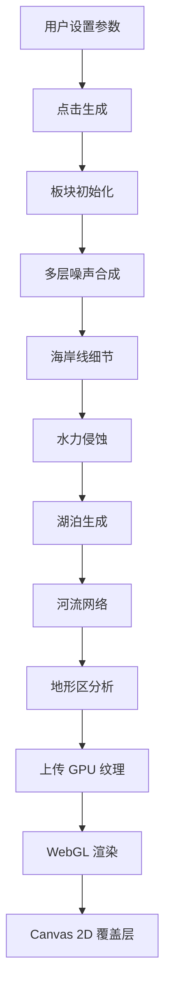

# Material Map Generator v0.4.0 — 产品需求文档

## 1. 产品概述

基于程序化噪声与板块构造模拟的地图生成工具。以更高性能复刻原 v0.3.9 HTML 版本的完整功能，采用 React + TypeScript + WebGL2 架构，保留所有地形生成、气候模拟、河流水系、激光指针、标签管理、多风格渲染与导出功能。

## 2. 核心功能

### 2.1 地图生成引擎
- 程序化噪声：Simplex / Perlin / Value / Worley
- FBM 变体：Standard / Ridged / Billowy / Domain Warp
- 板块构造模拟：4~32 个板块，大陆/海洋类型，碰撞边界计算
- 地形系统：侵蚀模拟、山脉褶皱、温度偏移、雪线、海岸线细节、湖泊密度
- 河流网络：基于梯度下降的水系生成
- 地形区分析：山脉/高原/丘陵/平原/沙漠/森林/湿地/苔原/冰盖/盆地

### 2.2 渲染系统
- 10 种渲染风格：低多边形、地形高程、板块着色、羊皮卷、卫星视图、地形详情、生物群落、等高线、地形浮雕、Azgaar 风格
- 光照系统：平行光角度、点光源（位置/强度/颜色）、大气光晕
- 图层控制：地形底图、板块边界、河流水系、等高线、板块名称、选中高亮、地形区标注
- 海拔尺、比例网格、气候分区、地理标注

### 2.3 交互系统
- 激光指针：拖拽选区、流光轨迹、自动选区、防抖平滑
- 光标系统：鼠标/触摸/方向键控制、十字线、标签
- 触控缩放/平移（移动端）
- 底部抽屉拖拽（移动端竖屏）

### 2.4 数据管理
- 本地存储：IndexedDB 保存/加载地图配置
- 导出：PNG / JPEG / WebP / BMP / 高程 JSON / 完整地形 JSON
- 标签管理：板块名称与地形区名称自定义编辑
- 版本生成器：批量生成多版本 HTML 文件

### 2.5 UI 系统
- 双主题：Classic（Material Design）/ Modern（玻璃态暗色）
- 国际化：中文 / 英文
- 性能监控：FPS、渲染耗时、生成耗时、内存占用
- 系统诊断：自动化测试套件

## 3. 核心流程

## 4. 界面设计

### 4.1 设计风格
- Classic：深色 Material Design，紫色主色调，卡片式布局
- Modern：暗夜星云背景，玻璃态浮动面板，渐变紫罗兰强调色
- 字体：Roboto + PingFang SC（中文回退）
- 布局：左侧固定控制面板 + 右侧主画布（桌面端）；底部浮动面板 + 全屏画布（移动端）

### 4.2 响应式适配
- 桌面端（>860px）：左侧 340px 抽屉，双列卡片布局（Modern）
- 平板端（<=860px）：固定侧边抽屉，底部 FAB 按钮组
- 移动端竖屏：底部 sheet，拖拽调整高度，三档吸附
- 移动端横屏：右侧边面板，紧凑布局

## 5. 性能目标

- 1024² 地图生成 < 3s（桌面端）
- 渲染循环 60 FPS
- 内存增长 < 5MB/100 次渲染
- 支持 LOD 降级预览（先生成低分辨率，再生成完整分辨率）
