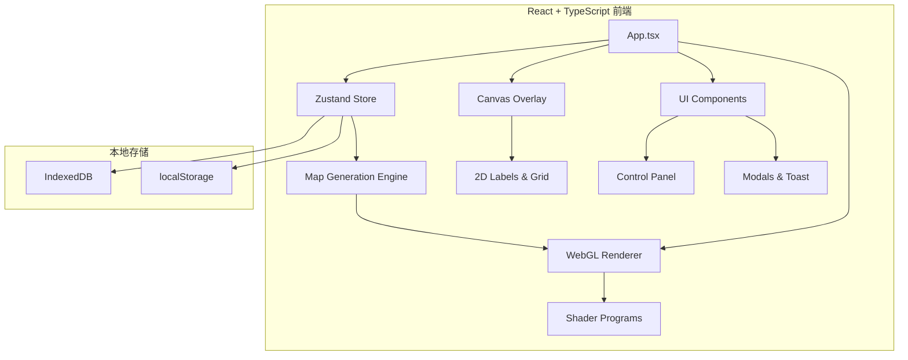

# Material Map Generator v0.4.0 — 技术架构文档

## 1. 架构设计



## 2. 技术选型

- **前端框架**: React 18 + TypeScript
- **构建工具**: Vite
- **状态管理**: Zustand
- **样式方案**: Tailwind CSS + CSS Variables（主题系统）
- **渲染引擎**: WebGL2（原生，无 Three.js）
- **国际化**: 自建 i18n 模块
- **存储**: IndexedDB（地图数据）+ localStorage（UI 偏好）

## 3. 项目结构

```
src/
├── main.tsx                 # 应用入口
├── App.tsx                  # 根组件
├── store/
│   └── useMapStore.ts       # Zustand 状态管理
├── engine/
│   ├── noise.ts             # 噪声引擎（Simplex/Perlin/Value/Worley）
│   ├── tectonic.ts          # 板块构造引擎
│   ├── erosion.ts           # 水力侵蚀模拟
│   ├── rivers.ts            # 河流网络生成
│   ├── regions.ts           # 地形区分析
│   └── index.ts             # 引擎入口
├── renderer/
│   ├── webgl.ts             # WebGL 上下文与程序管理
│   ├── textures.ts          # 纹理上传与管理
│   ├── shaders/
│   │   ├── vertex.glsl      # 顶点着色器
│   │   └── fragment.glsl    # 片段着色器
│   └── overlay.ts           # Canvas 2D 覆盖层
├── components/
│   ├── ControlPanel.tsx     # 控制面板
│   ├── CanvasContainer.tsx  # 画布容器
│   ├── SplashScreen.tsx     # 启动屏
│   ├── GenOverlay.tsx       # 生成进度遮罩
│   ├── LaserPointer.ts      # 激光指针逻辑
│   ├── CursorSystem.ts      # 光标系统
│   ├── ExportMenu.tsx       # 导出菜单
│   ├── StorageModal.tsx     # 存储管理
│   ├── TestModal.tsx        # 系统诊断
│   ├── LabelEditModal.tsx   # 标签编辑
│   └── Toast.tsx            # 通知提示
├── hooks/
│   ├── useWebGL.ts          # WebGL 初始化与生命周期
│   ├── useMapGeneration.ts  # 地图生成流程
│   ├── useLaser.ts          # 激光指针交互
│   ├── useCursor.ts         # 光标交互
│   ├── useTouchZoom.ts      # 触控缩放
│   └── useOrientation.ts    # 方向检测
├── i18n/
│   ├── zh.ts                # 中文翻译
│   ├── en.ts                # 英文翻译
│   └── index.ts             # i18n 入口
├── utils/
│   ├── hash.ts              # 种子哈希
│   ├── storage.ts           # 安全存储包装
│   ├── perf.ts              # 性能监控
│   └── helpers.ts           # 通用工具
└── types/
    └── index.ts             # TypeScript 类型定义
```

## 4. 关键性能优化策略

1. **Worker 线程**: 地图生成算法移至 Web Worker，避免阻塞主线程
2. **纹理复用**: 预分配 Float32Array 缓冲区，避免生成过程中的内存分配
3. **LOD 系统**: 先生成 1/2 分辨率预览，再生成完整分辨率
4. **rAF 节流**: 渲染请求合并到单一 requestAnimationFrame
5. **选择掩码缓存**: 256x1 纹理缓存选中状态，避免重复上传
6. **轨迹纹理脏标记**: 仅当轨迹变化时重绘 Canvas
7. **覆盖层参数缓存**: 避免相同参数的重复绘制

## 5. 状态设计

```typescript
interface MapState {
  // 生成参数
  seedStr: string;
  mapSize: number;
  mapAspect: string;
  plateCount: number;
  landmass: number;
  noiseType: 'simplex' | 'perlin' | 'value' | 'worley';
  fbmType: 'standard' | 'ridged' | 'billowy' | 'warped';
  octaves: number;
  lacunarity: number;
  persistence: number;
  seaLevel: number;
  erosionStrength: number;
  erosionIterations: number;
  mountainFold: number;
  tempOffset: number;
  snowLine: number;
  coastDetail: number;
  lakeDensity: number;
  
  // 渲染参数
  style: number;
  showBoundaries: boolean;
  boundaryWidth: number;
  boundaryColor: [number, number, number];
  showNames: boolean;
  showRivers: boolean;
  showContours: boolean;
  contourInterval: number;
  showTerrain: boolean;
  showSelection: boolean;
  showClimate: boolean;
  showGrid: boolean;
  showElevScale: boolean;
  showRegionNames: boolean;
  geoLabels: boolean;
  lightAngle: number;
  pointLightEnabled: boolean;
  pointLightPos: [number, number];
  pointLightIntensity: number;
  pointLightColor: [number, number, number];
  glowEnabled: boolean;
  
  // 细节生成器
  detailRiverWidth: number;
  detailRiverCurve: number;
  detailCoastJagged: number;
  detailRidgeDensity: number;
  detailRainfallOffset: number;
  detailTempGradient: number;
  detailBiomeBlend: number;
  
  // 交互状态
  laserActive: boolean;
  trailEnabled: boolean;
  laserSmooth: boolean;
  cursorActive: boolean;
  
  // 标签
  customPlateNames: Record<number, string>;
  customRegionNames: Record<number, string>;
  
  // 系统状态
  _needsRegen: boolean;
  _isGenerating: boolean;
  perfEnabled: boolean;
}
```

## 6. WebGL 管线

- **顶点着色器**: 全屏四边形，输出 v_uv
- **片段着色器**: 采样 5 张数据纹理（plate/elev/moist/temp/river），根据 u_style 分支到 10 种着色函数
- **Uniforms**: 40+ 个 uniform 控制渲染参数
- **纹理格式**: RGBA32F（数据纹理）+ R8（选择掩码）
