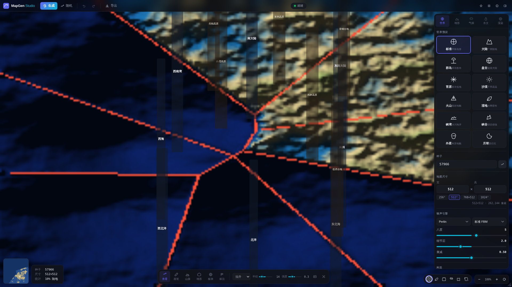

# Material Map Generator

[](https://github.com/qwerrrtttyyy/mapgen/releases)
[](LICENSE)
[](https://github.com/qwerrrtttyyy/mapgen)
[](https://github.com/qwerrrtttyyy/mapgen/stargazers)

基于程序化噪声和板块构造模拟的地图生成工具，使用 WebGL2 渲染，Material Design 3 深色主题 UI。前端可独立运行全功能；可选 Node.js 后端提供 REST + SSE 远程生成与持久化。

## 截图



> 截图来自 v0.0.3-pre 实际运行，使用 Playwright + headless Chromium 自动捕获。如需提交更精美的截图，欢迎运行 `bun run dev` 后保存到 `docs/screenshots/` 并发 PR。

## Demo

> 🌐 在线 Demo 待部署。计划通过 GitHub Pages 提供静态演示，地址会在发布后填入此处。

如需本地预览，参见下方 [快速开始](#快速开始)。

## 发行版

| 版本 | 日期 | 说明 |
|------|------|------|
| [v0.0.3-pre](https://github.com/qwerrrtttyyy/mapgen/releases/tag/v0.0.3-pre) | 2026-07-06 | 后端抽象层、模块质量提升、Bun 迁移 |
| [v0.0.2](https://github.com/qwerrrtttyyy/mapgen/releases/tag/v0.0.2) | 2026-06-28 | 复杂世界式全局生成 — 洋流/冰盖/流域/火山/季节 |
| [v0.0.1](https://github.com/qwerrrtttyyy/mapgen/releases/tag/v0.0.1) | 2026-06-26 | Monorepo 重写版 — WebGL2 + Material Design 3 |

完整历史：[CHANGELOG.md](CHANGELOG.md) · [GitHub Releases](https://github.com/qwerrrtttyyy/mapgen/releases)

## 快速开始

```bash
bun install
bun run dev        # 前端开发模式 → http://localhost:3000
bun run dev:server # 后端开发模式 → http://localhost:8787
bun run dev:all    # 同时启动前端 + 后端
bun run build      # 生产构建
bun run build:server # 仅构建后端
bun run typecheck  # 类型检查
bun test           # 运行全部测试
```

> **前置要求**: [Bun](https://bun.sh/) ≥ 1.2.0

## 功能

| 类别 | 功能 |
|------|------|
| 噪声 | Perlin, Simplex, Value, Worley |
| FBM | 标准, 山脊, 膨胀, 扭曲 |
| 构造 | 板块生成, 边界计算, 碰撞检测 |
| 侵蚀 | 水力侵蚀, 湖泊生成, 河流网络 |
| 气候 | 温度, 湿度, 生物群落分带 |
| 行星系统 | 洋流, 冰盖, 火山, 流域, 季节 |
| 渲染 | 地形, 板块, 羊皮纸, 卫星, 低多边形, 生物群落, 等高线, 浮雕, Azgaar, 洋流条纹, 冰盖覆盖 等 19 种风格 |
| 交互 | 板块选区, 激光工具, 光标悬停, 检查点保存/恢复 |
| 界面 | Material Design 3, 深色/亮色主题, 响应式布局, 移动端适配 |

## 架构

```
mapgen/
├── packages/
│   ├── shared/          @mapgen/core — 核心引擎（TypeScript）
│   │   └── src/
│   │       ├── pipeline/      # 分阶段生成管线
│   │       ├── noise.ts       # 噪声生成
│   │       ├── tectonic.ts    # 板块构造
│   │       ├── erosion.ts     # 侵蚀模拟
│   │       ├── rivers.ts      # 河流生成
│   │       └── regions.ts     # 区域分析
│   ├── shared-types/    @mapgen/shared-types — 跨边界类型契约与序列化
│   ├── web/             @mapgen/web — 前端应用（TypeScript + Vite）
│   │   ├── public/
│   │   │   ├── shaders/       # GLSL ES 3.00 着色器
│   │   │   └── style.css      # Material Design 3 令牌
│   │   └── src/
│   │       ├── engine/        # MapGenEngine 抽象层（Local/Remote Provider）
│   │       ├── app.ts         # 应用主逻辑
│   │       └── renderer/
│   │           ├── webgl.ts   # WebGL2 渲染器
│   │           └── canvas2d.ts # Canvas2D 回退
│   ├── manager/         @mapgen/manager — 配置 CRUD 与版本管理
│   └── server/          @mapgen/server — 可选参考后端（Hono + in-memory）
│       └── src/
│           ├── routes/        # REST API
│           └── services/      # 任务队列、地图存储
├── turbo.json           # Turborepo 配置
├── CHANGELOG.md         # 更新日志（规范）
├── AGENTS.md            # AI Agent 上下文
└── docs/
    ├── adr/             # 架构决策记录
    ├── agents/          # Agent 文档
    └── archive/         # 历史过程文档
```

## 技术栈

| 层 | 技术 |
|----|------|
| 语言 | TypeScript (ES2020, strict) |
| 渲染 | WebGL2 / Canvas2D |
| 样式 | Material Design 3 (CSS Custom Properties) |
| 着色器 | GLSL ES 3.00 |
| 构建 | Turborepo + Vite + tsc |
| 包管理 | Bun workspaces |
| 后端（可选）| Hono + in-memory 存储 + REST + SSE |
| 测试 | Bun test |
| Lint | ESLint + Prettier |

## 开发

```bash
bun run lint          # ESLint 检查
bun run lint:fix      # 自动修复
bun run format        # Prettier 格式化
bun run typecheck     # 类型检查
bun test              # 运行测试
```

当前测试状态：**213/213 通过**（core 185 + manager 25 + shared-types 1 + server 2）

## 贡献

欢迎通过 Issue 和 PR 贡献！请先阅读：

- [CHANGELOG.md](CHANGELOG.md) — 了解项目演进
- [AGENTS.md](AGENTS.md) — 了解架构与开发约定
- [docs/adr/](docs/adr/) — 架构决策记录

### 提交截图

如果你运行后想分享截图，请：
1. 保存到 `docs/screenshots/` 目录
2. 在 README 的"截图"章节插入图片
3. 提交 PR

## 许可证

[MIT](LICENSE)
